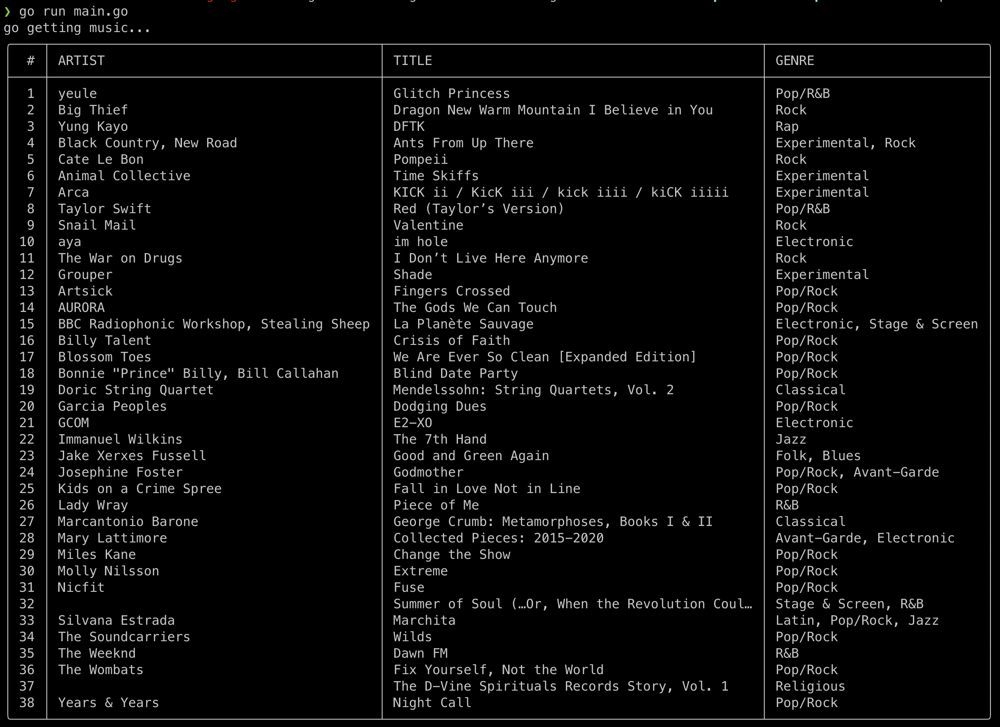

# go-get-music

This was my first project in Go, so lower your expectations...

This is a CLI that reports the best new music of the past few weeks.

Results are aggregated from Pitchfork, All Music etc.

Future work could include creating a playlist for spotify or apple music based on results, updating periodically by means of something like a cron job
